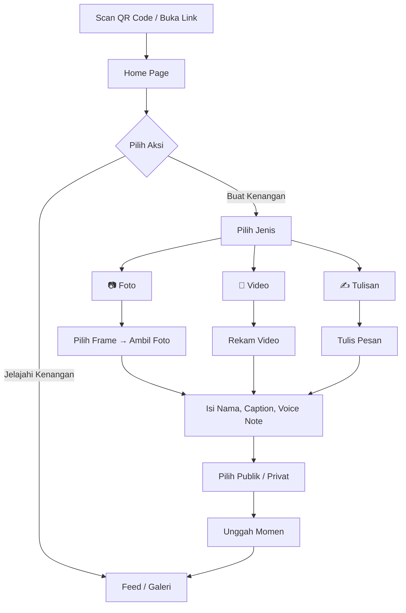

<div align="center">

# 📸 Virtual Photobooth — Randy & Azizah

**Platform interaktif untuk mengabadikan momen pernikahan secara digital.**


</div>

---

## 📖 Deskripsi

Virtual Photobooth adalah aplikasi web **mobile-first** yang dirancang khusus untuk pernikahan **Randy & Azizah** dengan tema adat/elegan bergaya **Minang**. Aplikasi ini memungkinkan tamu undangan untuk:

- 📷 **Berfoto** dengan bingkai (frame) kustom bertema pernikahan
- 🎥 **Merekam video** ucapan & doa secara langsung
- 🎙️ **Merekam voice note** sebagai pesan suara
- ✍️ **Menulis ucapan** tertulis untuk kedua mempelai
- 🖼️ **Melihat galeri** momen dari seluruh tamu secara real-time

Tampilan dioptimalkan untuk smartphone (maks. lebar 480px) dan dipusatkan di layar desktop.

---

## ✨ Fitur Utama

| Fitur | Deskripsi |
|---|---|
| **Home** (`/`) | Layar penyambutan dengan nama pengantin & navigasi utama |
| **Capture** (`/capture`) | Ambil foto, rekam video, atau tulis ucapan dengan alur multi-langkah |
| **Feed** (`/feed`) | Timeline real-time semua unggahan tamu (foto, video, ucapan) |
| **Wedding Book** (`/book`) | Buku tamu digital — kumpulan ucapan dalam format buku kenangan |
| **Memory Wall** (`/memory-wall`) | Galeri masonry seluruh foto & visual dari acara |
| **Bride Gallery** (`/bride`) | Galeri foto pre-wedding / foto resmi pengantin |
| **Bride QR** (`/bride/qr`) | Kode QR untuk diletakkan di meja tamu — scan langsung masuk ke aplikasi |

### Fitur Tambahan
- 🎬 **Animasi transisi halaman** (Framer Motion)
- 🖼️ **Pilihan frame foto** (Netflix Classic, Netflix Movie, dsb.)
- 🔒 **Mode privasi** — tamu bisa memilih publik/privat untuk setiap unggahan
- 🎤 **Voice note** opsional pada entri foto & video
- ✨ **Particle effects** pada loading screen (tsParticles)
- 📱 **Mobile-first responsive** — full screen di HP, centered frame di desktop

---

## 📱 Panduan Penggunaan (Untuk Tamu Undangan)

Berikut adalah panduan langkah demi langkah menggunakan aplikasi Virtual Photobooth:

### 1. Halaman Utama (Home)

Saat pertama kali membuka aplikasi, kamu akan disambut oleh halaman utama. Di bagian bawah layar, terdapat dua pilihan utama:

- **📸 Buat Kenangan** — Klik tombol ini untuk mulai membuat foto, video, rekaman suara, atau menulis pesan ucapan untuk kedua mempelai.
- **📖 Jelajahi Kenangan** — Klik tombol ini untuk melihat galeri (feed) yang berisi kumpulan foto, video, dan ucapan dari tamu-tamu lain.

### 2. Membuat Kenangan Baru

Jika kamu memilih **"Buat Kenangan"**, kamu akan dipandu melewati beberapa langkah mudah:

#### Langkah 1: Pilih Jenis Kenangan

Pilih format kenangan yang ingin kamu tinggalkan. Ada 3 opsi yang bisa dipilih:

| Opsi | Deskripsi |
|---|---|
| 📷 **Kirim Foto** | Kirim foto dengan pesan suara dan abadikan dalam bingkai spesial |
| 🎥 **Kirim Video** | Rekam video singkat berisi ucapan dan doa secara langsung |
| ✍️ **Tulisan Saja** | Ingin mengirimkan doa tanpa wajah/suara? Ketik pesan tertulis |

#### Langkah 2: Persiapan

Setelah memilih jenis kenangan, kamu akan masuk ke halaman persiapan:

- Khusus jika memilih **Foto**, kamu akan diminta untuk memilih **desain bingkai (*frame*)** favoritmu.
- Jika memilih Video atau Tulisan, kamu bisa langsung klik **Lanjut**.

#### Langkah 3: Pengambilan Momen

Bergantung pada jenis kenangan yang kamu pilih sebelumnya:

- **Jika memilih Foto** — Kamera akan terbuka. Tekan tombol kamera untuk mengambil foto. Jika kurang puas, kamu bisa mengulang (*retake*). Jika sudah pas, klik **Gunakan Foto Ini**.
- **Jika memilih Video** — Tekan tombol rekam untuk mulai merekam video ucapanmu, dan tekan tombol stop untuk mengakhiri rekaman.
- **Jika memilih Tulisan Saja** — Ketikkan teks berisi pesan ucapan dan doamu.

#### Langkah 4: Lengkapi Detail & Publikasi

Setelah momen berhasil ditangkap, kamu akan masuk ke halaman terakhir untuk diunggah:

1. **Masukkan namamu** agar kedua mempelai tahu dari siapa kenangan ini berasal.
2. Untuk tipe Foto dan Video, kamu memiliki opsi tambahan:
   - Menuliskan **Caption** (keterangan/pesan singkat).
   - Merekam **Voice Note** (pesan suara).
3. Pilih mode privasi:
   - 🌐 **Publik** — bisa dilihat tamu lain di Feed.
   - 🔒 **Privat** — hanya bisa dilihat oleh kedua mempelai.
4. Klik **Unggah Momen**. Sistem akan memproses kenanganmu. Tunggu beberapa saat hingga muncul notifikasi sukses!

### 3. Menjelajahi Galeri (Feed)

Jika kamu memilih **"Jelajahi Kenangan"** dari halaman utama, kamu akan dibawa ke halaman **Feed/Galeri**:

- **Melihat Kumpulan Ucapan** — Gulir (*scroll*) ke bawah untuk melihat semua foto, video, tulisan, dan voice note dari tamu undangan lainnya.
- **Melihat Detail Penuh** — Klik salah satu kenangan di galeri untuk membukanya dalam tampilan layar penuh (*Full View*), sehingga foto, video, atau teksnya terlihat lebih jelas.
- **Membuat Kenangan Baru** — Saat berada di halaman galeri, kamu bisa mengklik tombol **"📸 Buat kenangan"** yang melayang di layar.

### Diagram Alur



---

## 🛠️ Tech Stack

### Frontend
| Teknologi | Versi | Kegunaan |
|---|---|---|
| [React](https://react.dev) | 19 | UI library |
| [Vite](https://vite.dev) | 8 | Build tool & dev server |
| [Tailwind CSS](https://tailwindcss.com) | 4 | Utility-first CSS framework |
| [React Router](https://reactrouter.com) | 7 | Client-side routing |
| [Framer Motion](https://www.framer.com/motion/) | 12 | Animasi & transisi halaman |
| [Supabase JS](https://supabase.com/docs/reference/javascript) | 2 | Database & cloud storage client |
| [React Webcam](https://github.com/mozmorris/react-webcam) | 7 | Akses kamera perangkat |
| [Lucide React](https://lucide.dev) | 1 | Ikon SVG |
| [tsParticles](https://particles.js.org) | 4 | Efek partikel animasi |

### Backend
| Teknologi | Versi | Kegunaan |
|---|---|---|
| [Express](https://expressjs.com) | 5 | HTTP server & REST API |
| [Multer](https://github.com/expressjs/multer) | 2 | Upload file (multipart/form-data) |
| [CORS](https://github.com/expressjs/cors) | 2 | Cross-Origin Resource Sharing |

### Infrastruktur
| Layanan | Kegunaan |
|---|---|
| [Supabase](https://supabase.com) | Database (tabel `entries`) & Storage (bucket: `Photos`, `Videos`, `Audio`) |

### Linter
| Tool | Kegunaan |
|---|---|
| [Oxlint](https://oxc.rs) | JavaScript/JSX linter |

---

## 📂 Struktur Proyek

```
virtual-photobooth-renzi/
├── frontend/                   # Aplikasi React (Vite)
│   ├── public/                 # Aset statis (frame, foto, favicon, QR)
│   ├── src/
│   │   ├── assets/             # Gambar & media yang di-import
│   │   ├── components/         # Komponen reusable
│   │   │   ├── capture/        # Komponen alur Capture (kamera, frame, dsb.)
│   │   │   ├── feed/           # Komponen Feed (FeedCard, dsb.)
│   │   │   ├── ui/             # Komponen UI generik
│   │   │   ├── GsapKit.jsx     # Utilitas animasi GSAP
│   │   │   └── LoadingScreen.jsx
│   │   ├── constants/          # Konstanta & konfigurasi
│   │   ├── contexts/           # React Context (AlertContext, dsb.)
│   │   ├── hooks/              # Custom React hooks
│   │   ├── lib/                # Library helpers (Supabase client, dsb.)
│   │   ├── pages/              # Halaman utama
│   │   │   ├── Home.jsx
│   │   │   ├── Capture.jsx
│   │   │   ├── Feed.jsx
│   │   │   ├── WeddingBook.jsx
│   │   │   ├── MemoryWall.jsx
│   │   │   ├── BrideGallery.jsx
│   │   │   └── BrideQR.jsx
│   │   ├── utils/              # Fungsi utilitas
│   │   ├── App.jsx             # Root component & routing
│   │   ├── App.css             # Styling tambahan
│   │   ├── index.css           # Design tokens & tema global
│   │   └── main.jsx            # Entry point React
│   ├── .env                    # Environment variables (Supabase keys)
│   ├── vite.config.js          # Konfigurasi Vite
│   └── package.json
│
├── backend/                    # Express.js API server
│   ├── public/uploads/         # Direktori penyimpanan file upload lokal
│   ├── server.js               # Entry point server (API routes)
│   ├── db.json                 # Database JSON sederhana (fallback lokal)
│   └── package.json
│
├── Deskripsi_Virtual_Photobooth.txt   # Dokumentasi deskripsi lengkap proyek
├── TUTORIAL_USER.md                    # Panduan penggunaan untuk tamu
└── README.md                           # ← File ini
```

---

## 🚀 Cara Menjalankan

### Prasyarat

- **Node.js** ≥ 18
- **npm** ≥ 9
- Akun **Supabase** (untuk database & storage di production)

### 1. Clone Repository

```bash
git clone <repository-url>
cd virtual-photobooth-renzi
```

### 2. Setup Frontend

```bash
cd frontend
npm install
```

Buat file `.env` di folder `frontend/` (jika belum ada) dan isi dengan kredensial Supabase:

```env
VITE_SUPABASE_URL=https://your-project.supabase.co
VITE_SUPABASE_ANON_KEY=your-anon-key-here
```

Jalankan dev server:

```bash
npm run dev
```

Frontend akan berjalan di `http://localhost:5173` (default Vite).

### 3. Setup Backend (Opsional — untuk mode lokal)

```bash
cd backend
npm install
node server.js
```

Backend akan berjalan di `http://localhost:5000`.

> **Catatan:** Backend Express ini bersifat opsional dan digunakan sebagai fallback lokal. Di production, aplikasi menggunakan **Supabase** secara langsung dari frontend.

---

## 🎨 Tema & Desain

Aplikasi ini mengusung identitas visual **Minang — Elegan & Klasik** dengan palet warna yang konsisten:

| Token | Warna | Kegunaan |
|---|---|---|
| `--color-canvas` | `#f7f2e9` | Background utama (broken-white hangat) |
| `--color-panel` | `#efe4d3` | Surface nested / footer |
| `--color-cream` | `#fffce1` | Teks terang & border |
| `--color-maroon` | `#6b1420` | **Aksen utama** — tombol, heading, modal |
| `--color-maroon-deep` | `#4c0e17` | Divider & footer accent |
| `--color-accent-light` | `#9c3b48` | Hover & variasi rose |
| `--color-accent-soft` | `#f0dde0` | Bayangan rose pucat |

### Tipografi

| Peran | Font | Kegunaan |
|---|---|---|
| Display | **Poppins** | Judul halaman, teks hero |
| Heading | **Montserrat** | Header kartu, sub-judul |
| Body | **Roboto** / **Inter Tight** | Paragraf, caption, tombol |
| Couple Name | **Birthstone** | Nama pengantin ("Randy & Azizah") |
| Dekoratif | **Great Vibes** | Elemen kaligrafi elegan |

### Kontrol UI

Semua tombol menggunakan gaya **pill-shaped** (`border-radius: 100px`) — baik solid maroon (`gradient-pill`) maupun ghost outline (`ghost-pill`).

---

## 📡 API Endpoints (Backend Lokal)

| Method | Endpoint | Deskripsi |
|---|---|---|
| `POST` | `/api/upload` | Upload entri baru (foto + audio opsional) |
| `GET` | `/api/feed` | Ambil semua entri untuk Feed |

### Upload Request Body (`multipart/form-data`)

| Field | Tipe | Wajib | Deskripsi |
|---|---|---|---|
| `name` | `string` | ✅ | Nama pengirim |
| `photo` | `file` | ✅ | File foto |
| `audio` | `file` | ❌ | File voice note |
| `frame` | `string` | ❌ | Jenis frame (default: `"default"`) |
| `caption` | `string` | ❌ | Caption/keterangan |

---

## 🧪 Scripts

### Frontend

```bash
npm run dev       # Jalankan dev server (Vite)
npm run build     # Build production bundle
npm run preview   # Preview production build
npm run lint      # Jalankan Oxlint
```

### Backend

```bash
node server.js    # Jalankan Express server
```

---

## 📄 Dokumentasi Tambahan

- [**TUTORIAL_USER.md**](./TUTORIAL_USER.md) — Panduan lengkap penggunaan untuk tamu undangan
- [**Deskripsi_Virtual_Photobooth.txt**](./Deskripsi_Virtual_Photobooth.txt) — Rincian konsep, UI/UX, dan arsitektur proyek
- [**frontend/DESIGN.md**](./frontend/DESIGN.md) — Dokumentasi sistem desain detail

---

## 📝 Lisensi

Proyek ini dibuat secara khusus untuk acara pernikahan **Randy & Azizah**.

---

<div align="center">

**Made with ❤️ by Renzi**

</div>
